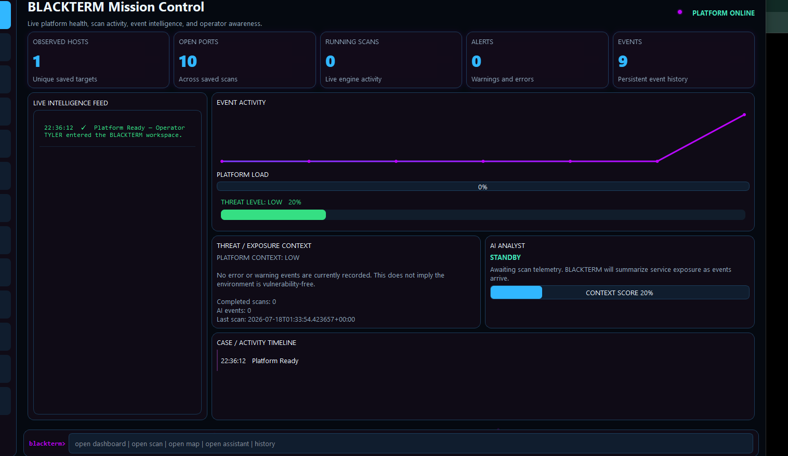

<div align="center">

# BLACKTERM Platform

### An AI-powered cybersecurity desktop workspace

[](https://www.python.org/)
[](https://doc.qt.io/qtforpython-6/)
[](#installation)
[](LICENSE)
[](ROADMAP.md)
[](CHANGELOG.md)

**Mission Control • Reconnaissance • Live Telemetry • AI Analysis • Case Timelines • Reports**

</div>

---



## Overview

BLACKTERM is a modular desktop cybersecurity platform that brings reconnaissance, live event intelligence, AI-assisted analysis, reporting, and investigation workflows into one polished interface.

The current public preview centers on **Mission Control**: a live operational dashboard with scan metrics, event activity, exposure context, an AI analyst panel, persistent telemetry, and a case-style activity timeline.

> [!IMPORTANT]
> BLACKTERM is intended only for systems you own or have explicit permission to test. Unauthorized scanning or access may be illegal.

## Current Features

- **Mission Control** — live hosts, ports, scans, alerts, and event counters
- **Recon Engine** — threaded TCP scanning, service detection, banners, CIDR support, and saved history
- **Live Intelligence Feed** — timestamped and severity-aware platform events
- **AI Analyst Experience** — reactive summaries, context scoring, and typed analysis states
- **Threat & Exposure Context** — operational status and risk awareness
- **Case / Activity Timeline** — chronological scan and platform activity
- **Reports** — exportable HTML and PDF scan reports
- **Network Workspace** — topology visualization and host-inspection foundation
- **Plugin Architecture** — expandable module system
- **Persistent Storage** — SQLite-backed history and events
- **Modern Desktop UI** — PySide6, animated counters, particles, dock navigation, toasts, and a boot sequence

## Installation

### Requirements

- Windows 10 or Windows 11
- Python 3.11 or newer
- PowerShell

### Development setup

```powershell
git clone https://github.com/cojjjj/blackterm-platform.git
cd blackterm-platform
python -m venv .venv
.\.venv\Scripts\Activate.ps1
python -m pip install --upgrade pip
python -m pip install -e ".[dev]"
python -m pytest
blackterm gui
```

If PowerShell blocks activation:

```powershell
Set-ExecutionPolicy -Scope Process -ExecutionPolicy Bypass
.\.venv\Scripts\Activate.ps1
```

## Project Direction

BLACKTERM is growing beyond a standalone scanner into a unified cybersecurity workspace where modules share cases, telemetry, reports, and a consistent desktop experience.

Planned modules include:

- Interactive network graph
- OSINT workspace
- PhishScan integration
- PCAP analysis
- Threat-intelligence enrichment
- Evidence and case management
- Windowed BLACKTERM OS workspace
- Workspace persistence

See the complete [roadmap](ROADMAP.md).

## Repository Structure

```text
blackterm-platform/
├── blackterm_recon/       # Engine, events, storage, reports, and desktop UI
├── tests/                 # Automated test suite
├── docs/                  # Architecture and project documentation
├── screenshots/           # Product images and demos
├── CHANGELOG.md
├── CONTRIBUTING.md
├── ROADMAP.md
├── SECURITY.md
├── LICENSE
└── pyproject.toml
```

## Responsible Use

Only scan or analyze assets you own or are explicitly authorized to test. BLACKTERM is built for education, defensive security, lab use, authorized assessments, and portfolio development.

## Contributing

Ideas, bug reports, and focused pull requests are welcome. Read [CONTRIBUTING.md](CONTRIBUTING.md) before contributing.

## Security

Do not publish sensitive vulnerability details in a public issue. Follow [SECURITY.md](SECURITY.md).

## License

Released under the [MIT License](LICENSE).

---

<div align="center">

Built by [cojjjj](https://github.com/cojjjj) — active development, public preview.

</div>

<!-- BLACKTERM_STATS_START -->
## `blackterm> project --stats`

```text
╔══════════════════════════════════════════════════════════════╗
║                 BLACKTERM PLATFORM v7.0.0                 ║
╚══════════════════════════════════════════════════════════════╝

 STATUS............... ONLINE
 DEVELOPMENT.......... ACTIVE
 SOURCE LINES......... 7,445
 TOTAL TRACKED LINES.. 8,568
 PYTHON LINES......... 7,949
 TEST LINES........... 504
 DOCUMENTATION LINES.. 503

 PYTHON FILES......... 82
 PROJECT FILES........ 97
 MODULES.............. 48
 DESKTOP PAGES........ 12
 TESTS DISCOVERED..... 47
 COMMITS.............. 5
 CONTRIBUTORS......... 2

 LANGUAGE TELEMETRY
 Python: 7,949 • Markdown: 503 • YAML: 59 • TOML: 34 • JSON: 23

 LAST REFRESH......... 2026-07-18T04:06:40+00:00
 NEXT OBJECTIVE....... AUTONOMOUS OSINT ENGINE
```

<p align="center">
  
</p>
<!-- BLACKTERM_STATS_END -->
