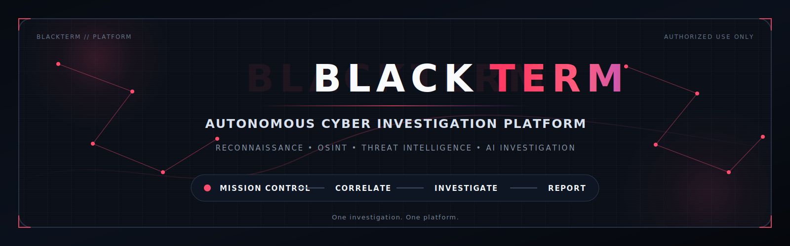
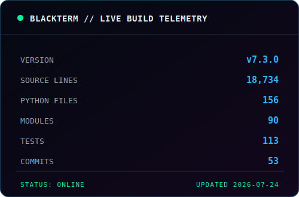

<div align="center">
  
</div>
<div align="center">


### Autonomous Cyber Investigation Platform

Reconnaissance • Attack Surface Intelligence • OSINT • Threat Intelligence • AI Investigation

<div align="center">

[📸 Interface Gallery](SCREENSHOTS.md) •
[🏗 Architecture](assets/architecture.svg) •
[🛣 Roadmap](ROADMAP.md) •
[🔒 Security](SECURITY.md)

</div>

*"One investigation. One platform."*

</div>


## 📚 Documentation

| Guide | Description |
|-------|-------------|
| 📸 [Screenshots](docs/SCREENSHOTS.md) | Complete tour of the BLACKTERM interface |
| 🏗️ [Architecture](docs/ARCHITECTURE.md) | Platform architecture and investigation pipeline |
| 🧠 [AI Engine](docs/AI.md) | AI investigation workflow |
| 🛣️ [Roadmap](docs/ROADMAP.md) | Upcoming features and milestones |
---

# 🚀 Overview

BLACKTERM is an **AI-powered desktop cyber investigation platform** built for security researchers, blue teams, students, and penetration testers. Rather than relying on multiple disconnected tools, BLACKTERM brings reconnaissance, intelligence gathering, attack surface analysis, case management, visualization, and reporting into one unified workspace.

Every investigation is organized as a case, allowing analysts to collect evidence, enrich indicators, visualize relationships, and generate reports without leaving the platform.

---

# ✨ Why BLACKTERM?

Most cybersecurity tools solve **one** problem.

BLACKTERM solves the **entire investigation workflow**.

Instead of switching between:

- Recon tools
- WHOIS websites
- DNS lookups
- Threat intelligence portals
- Notes
- Screenshots
- Reporting software

BLACKTERM combines everything into a single investigation platform.

---

# 🎯 Core Capabilities

| Capability | Description |
|------------|-------------|
| 🛰 Reconnaissance | Discover hosts, services and exposed infrastructure |
| 🌐 Attack Surface Intelligence | Analyze public-facing assets and technologies |
| 🔍 OSINT | WHOIS, DNS, SSL, HTTP, GeoIP and technology fingerprinting |
| 🛡 Threat Intelligence | Reputation analysis and IOC enrichment |
| 📁 Investigation Workspace | Organize evidence into cases |
| 🗺 Global Intelligence Map | Visualize investigation targets geographically |
| 🕸 Relationship Explorer | Discover relationships between domains, IPs and evidence |
| 🤖 AI Investigation | AI-assisted investigation summaries |
| 📊 Reporting | Export investigation reports and findings |

---

# 🖥 Platform Preview

> Replace these placeholders with screenshots as you continue developing BLACKTERM.

| Mission Control | Investigation Workspace |
|----------------|-------------------------|
|  |  |

| Threat Intelligence | Global Intelligence Map |
|--------------------|-------------------------|
|  |  |

| Relationship Explorer |
|------------------------|
|  |

---

# ⚡ Investigation Workflow

```text
Mission Control
        │
        ▼
Reconnaissance
        │
        ▼
Attack Surface Intelligence
        │
        ▼
OSINT Collection
        │
        ▼
Threat Intelligence
        │
        ▼
AI Investigation
        │
        ▼
Evidence Collection
        │
        ▼
Relationship Analysis
        │
        ▼
Case Report
```

Every investigation flows through the same structured pipeline, making findings reproducible, organized, and easy to review.

---

# 🧩 Platform Modules

## 🎯 Mission Control

Your central command dashboard for launching investigations, monitoring activity, and tracking active cases.

---

## 🛰 Recon Engine

Perform reconnaissance against authorized targets to collect technical information used throughout the investigation.

---

## 🌐 Attack Surface Intelligence

Identify exposed technologies, services, infrastructure, and publicly accessible assets.

---

## 🔍 OSINT Center

Collect publicly available intelligence including:

- WHOIS
- DNS
- SSL Certificates
- HTTP Headers
- Technology Detection
- GeoIP
- ASN Information

---

## 🛡 Threat Intelligence Center

Enrich indicators using threat intelligence sources to identify malicious infrastructure and suspicious activity.

---

## 🗂 Investigation Workspace

Organize every investigation into structured cases containing:

- Evidence
- Notes
- Screenshots
- Intelligence
- Relationships
- Reports

---

## 🌍 Global Intelligence Map

Visualize infrastructure and investigation targets across the world using an interactive geographic interface.

---

## 🕸 Relationship Explorer

Understand how evidence connects through an interactive graph of:

- Domains
- IP Addresses
- Certificates
- Technologies
- Organizations
- Cases

---

## 🤖 AI Investigation

Automatically summarize findings, identify patterns, and assist analysts with investigation reporting.

---

# 🚀 Quick Start

Clone the repository:

```bash
git clone https://github.com/cojjjj/blackterm-platform.git
```

Navigate into the project:

```bash
cd blackterm-platform
```

Install dependencies:

```bash
pip install -r requirements.txt
```

Launch BLACKTERM:

```bash
python main.py
```

---

# 📌 Project Goals

BLACKTERM is being built around five core principles:

- 🧠 Investigation First
- ⚡ Fast Intelligence Collection
- 📂 Organized Case Management
- 🌎 Visual Investigation
- 🤖 AI-Assisted Analysis

Every feature added to BLACKTERM supports one or more of these goals.

---

# 📈 Current Focus

Current development is focused on expanding BLACKTERM into a complete cyber investigation ecosystem through improvements to:

- Mission Control
- Autonomous Investigation Engine
- Threat Intelligence
- Global Intelligence Map
- Investigation Relationship Explorer
- AI Analysis
- Reporting
- Case Management

---

> **⚠️ Responsible Use**
>
> BLACKTERM is intended for defensive security research, education, and authorized security assessments only. Always obtain permission before scanning or investigating systems that you do not own or explicitly have authorization to test.
---

# 🏗 Platform Architecture

BLACKTERM follows a modular architecture designed around the lifecycle of a cyber investigation. Every subsystem focuses on a specific stage of intelligence collection, analysis, visualization, and reporting while remaining tightly integrated through a unified investigation workspace.

```text
                                   BLACKTERM

                             ┌────────────────────┐
                             │  Mission Control   │
                             └─────────┬──────────┘
                                       │
             ┌─────────────────────────┼─────────────────────────┐
             │                         │                         │
             ▼                         ▼                         ▼

      Recon Engine          Attack Surface Intelligence       OSINT Center

             │                         │                         │
             └───────────────┬─────────┴─────────┬───────────────┘
                             ▼
                   Threat Intelligence Center
                             │
                             ▼
                  AI Investigation Engine
                             │
              ┌──────────────┼──────────────┐
              ▼              ▼              ▼

      Case Workspace    Global Intelligence    Relationship Explorer

              │              │              │
              └──────────────┴──────────────┘
                             │
                             ▼
                    Reporting & Export
```

BLACKTERM was designed so every module contributes to the same investigation rather than operating as isolated utilities.

---

# 🧩 Platform Components

## 🎯 Mission Control

Mission Control acts as the operational dashboard for BLACKTERM.

It provides a centralized location for:

- Active investigations
- Recent activity
- Platform status
- Investigation shortcuts
- Threat summaries
- AI insights
- Case statistics

Mission Control serves as the starting point for every investigation.

---

## 🛰 Recon Engine

The Recon Engine gathers technical information from authorized targets.

Typical data collected includes:

- IP addresses
- Open ports
- HTTP services
- SSL certificates
- Redirect chains
- Server technologies
- Response headers

The collected data becomes the foundation for later intelligence modules.

---

## 🌐 Attack Surface Intelligence

Attack Surface Intelligence analyzes the public exposure of a target.

Examples include:

- Web technologies
- Security headers
- TLS configuration
- Certificate analysis
- CDN detection
- Redirects
- Reverse proxies
- Infrastructure fingerprinting

The goal is to quickly understand how a target is exposed to the internet.

---

## 🔍 OSINT Center

The OSINT Center enriches investigation data using publicly available intelligence.

Supported intelligence includes:

- WHOIS
- DNS
- GeoIP
- ASN
- HTTP Headers
- SSL Certificates
- Technology Detection
- Reverse DNS

OSINT information is automatically linked to the active investigation.

---

## 🛡 Threat Intelligence Center

Threat Intelligence determines whether collected indicators have been observed in malicious activity.

Capabilities include:

- Indicator reputation
- IOC enrichment
- Risk scoring
- Confidence scoring
- Threat summaries
- Evidence collection

Future versions will support additional commercial and community intelligence feeds.

---

## 🤖 AI Investigation Engine

The AI Investigation Engine assists analysts throughout the investigation.

Current goals include:

- Investigation summaries
- Technical explanations
- Pattern detection
- IOC correlation
- Report generation
- Risk explanation

The AI assists the analyst—it does not replace analyst judgment.

---

## 📂 Investigation Workspace

Every investigation is stored as a dedicated case.

Each case contains:

- Notes
- Evidence
- Screenshots
- Timeline
- Intelligence
- Relationships
- Reports

This keeps investigations organized and reproducible.

---

## 🌍 Global Intelligence Map

The Global Intelligence Map visualizes infrastructure across geographic regions.

Supported objects include:

- Domains
- IP addresses
- Hosting providers
- Countries
- Investigation nodes

Relationships between infrastructure become immediately visible.

---

## 🕸 Relationship Explorer

The Relationship Explorer reveals connections between collected evidence.

Relationships may include:

- Domain → IP
- IP → ASN
- Domain → Certificate
- Domain → Technology
- Domain → Case
- Domain → Threat Indicator

Interactive graph layouts allow investigators to discover infrastructure that would otherwise remain hidden.

---

# ⚡ Investigation Lifecycle

Every investigation follows a structured workflow.

```text
Target

 │

 ▼

Reconnaissance

 │

 ▼

Attack Surface Analysis

 │

 ▼

OSINT Collection

 │

 ▼

Threat Intelligence

 │

 ▼

AI Investigation

 │

 ▼

Evidence Collection

 │

 ▼

Relationship Analysis

 │

 ▼

Report Generation
```

This consistent workflow ensures investigations remain repeatable and well organized.

---

# 📁 Project Structure

```text
blackterm-platform/

├── blackterm/
│
├── core/
│   ├── scanner/
│   ├── intelligence/
│   ├── reports/
│   ├── ai/
│   ├── cases/
│   └── utils/
│
├── gui/
│   ├── mission_control/
│   ├── workspace/
│   ├── intelligence/
│   ├── map/
│   └── explorer/
│
├── assets/
│
├── docs/
│
├── screenshots/
│
├── tests/
│
└── main.py
```

---

# 🔒 Security Philosophy

BLACKTERM follows several core principles.

- Investigation-first design
- Modular architecture
- Evidence preservation
- Analyst transparency
- Explainable AI
- Offline-capable workflows where practical
- Responsible security research

Every feature is designed to support professional investigative workflows rather than automated exploitation.

---

# 🚀 Current Development

Current areas of active development include:

- Autonomous Investigation Engine
- Relationship Graph improvements
- Threat Intelligence expansion
- Interactive Global Intelligence Map
- Evidence Timeline
- AI Correlation Engine
- Advanced Reporting
- Plugin Framework
- Multi-case investigation support

These features represent the next major milestones in BLACKTERM's evolution.
---

# ⚙️ Configuration

BLACKTERM is designed to work out of the box, with additional functionality available through optional API integrations.

## Optional Providers

| Provider | Purpose | Required |
|----------|---------|:--------:|
| VirusTotal | File & URL reputation | ❌ |
| AbuseIPDB | IP reputation | ❌ |
| URLHaus | Malicious URL intelligence | ❌ |
| OTX | Threat intelligence | ❌ |
| Shodan *(Planned)* | Internet exposure | ❌ |
| Censys *(Planned)* | Infrastructure intelligence | ❌ |

If an API key is unavailable, BLACKTERM automatically disables that integration while continuing to operate normally.

---

# 🚀 Basic Usage

Launch the application:

```bash
python main.py
```

Typical investigation workflow:

```text
Launch BLACKTERM

↓

Create Investigation

↓

Enter Target

↓

Reconnaissance

↓

OSINT Collection

↓

Threat Intelligence

↓

AI Investigation

↓

Evidence Review

↓

Generate Report
```

---

# 💻 Example Use Cases

## Infrastructure Recon

- Discover technologies
- Collect DNS records
- Analyze certificates
- Review HTTP headers

---

## Threat Investigation

- Investigate suspicious domains
- Review malicious IP reputation
- Correlate indicators
- Generate investigation summary

---

## Security Assessments

- Attack surface review
- Technology fingerprinting
- Infrastructure mapping
- Documentation

---

## Education

BLACKTERM is also designed for:

- Cybersecurity students
- Blue Team practice
- Home labs
- Demonstrations
- Research

---

# 📊 Platform Highlights

✔ Unified Investigation Workspace

✔ AI-Assisted Investigation

✔ Modular Architecture

✔ Interactive Intelligence Visualization

✔ Case-Based Workflow

✔ Expandable Intelligence Providers

✔ Reporting Engine

✔ Global Infrastructure Mapping

✔ Relationship Analysis

✔ Professional Desktop Interface

---

# 🧪 Testing

BLACKTERM includes automated testing for core components where applicable.

Run all tests:

```bash
pytest
```

Run a specific module:

```bash
pytest tests/
```

As the platform grows, testing coverage will continue expanding alongside new modules.

---

# 📂 Documentation

Additional documentation is available within the repository.

```text
docs/

Architecture

Roadmap

Screenshots

Developer Guide

Workflow

Release Notes
```

---

# 🛣 Roadmap

## Current Generation

- ✅ Mission Control
- ✅ Investigation Workspace
- ✅ Threat Intelligence
- ✅ OSINT
- ✅ Global Intelligence Map
- ✅ Relationship Explorer
- ✅ AI Investigation
- ✅ Reporting

---

## Next Generation

- 🔄 Autonomous Investigation Engine
- 🔄 IOC Correlation
- 🔄 Timeline Replay
- 🔄 Advanced Case Management
- 🔄 Plugin SDK
- 🔄 Team Collaboration

---

## Long-Term Vision

The long-term goal for BLACKTERM is to become a complete desktop cyber investigation platform capable of supporting the full lifecycle of technical investigations while remaining intuitive, extensible, and investigator-focused.

---

# ❓ Frequently Asked Questions

## Is BLACKTERM free?

Yes. BLACKTERM is open source and released under the MIT License.

---

## Does BLACKTERM require API keys?

No.

Core functionality works without external APIs.

API integrations provide additional intelligence when configured.

---

## Can I contribute?

Absolutely.

Bug reports, feature requests, documentation improvements, and pull requests are all welcome.

---

## Is BLACKTERM intended for offensive security?

BLACKTERM is designed primarily for investigation, intelligence gathering, and defensive security workflows.

Users are responsible for ensuring they have authorization before investigating any target.

---

## Which operating systems are supported?

Current development focuses primarily on Windows.

Future platform support may expand over time.

---

# 🤝 Contributing

Contributions are welcome from developers, researchers, students, and security professionals.

Ways to contribute:

- Improve documentation
- Submit bug reports
- Suggest new modules
- Improve UI
- Expand testing
- Add threat intelligence integrations
- Improve investigation workflows

Please review **CONTRIBUTING.md** before opening a pull request.

---

# 🔒 Security

If you discover a security issue within BLACKTERM itself, please report it responsibly.

Please review **SECURITY.md** before publicly disclosing vulnerabilities.

---

# 📜 License

BLACKTERM is released under the MIT License.

See **LICENSE** for complete licensing information.

---

# 🙏 Acknowledgements

BLACKTERM has been inspired by the broader cybersecurity and open-source communities.

Special thanks to:

- Python Community
- OWASP
- MITRE ATT&CK
- TryHackMe
- Open-source security researchers
- Everyone who provides feedback and contributions

---

# ⭐ Support the Project

If you find BLACKTERM useful:

⭐ Star the repository

🐛 Report issues

💡 Suggest features

🤝 Contribute improvements

📢 Share the project with others

Community feedback helps shape the future of BLACKTERM.

---

# 📈 Project Statistics

> **Do not replace this section.**

Keep your existing automated telemetry block (`BLACKTERM_STATS_START` / `BLACKTERM_STATS_END`) directly below this heading so it continues updating automatically.

---

# 🔄 Investigation Lifecycle

BLACKTERM follows a structured investigation workflow that keeps reconnaissance, intelligence, evidence, and reporting connected inside a single workspace.

<div align="center">

```text
                    TARGET
                       │
                       ▼
              Reconnaissance Engine
                       │
                       ▼
        Attack Surface Intelligence
                       │
                       ▼
             OSINT Collection
                       │
                       ▼
        Threat Intelligence Correlation
                       │
                       ▼
          Investigation Workspace
                       │
                       ▼
       Relationship Graph & Timeline
                       │
                       ▼
            AI Investigation Engine
                       │
                       ▼
             Analyst Report Export
```

</div>

Every investigation becomes a persistent case containing:

- 🌐 Reconnaissance results
- 🔍 OSINT enrichment
- 🛡 Threat intelligence
- 🧠 AI-assisted analysis
- 🗺 Relationship visualization
- 📑 Evidence collection
- 📈 Investigation timeline
- 📄 Exportable reports

Instead of switching between separate reconnaissance, OSINT, visualization, and reporting tools, BLACKTERM keeps the complete investigation lifecycle inside one desktop platform.

# ✨ Platform Highlights

<table>
<tr>
<td width="50%">

### 🛰 Intelligence Collection

- Reconnaissance
- Attack Surface Analysis
- OSINT Pipeline
- Threat Intelligence
- IOC Correlation

</td>
<td width="50%">

### 📂 Investigation

- Case Management
- Evidence Locker
- Timeline
- Relationship Graph
- AI Assistant

</td>
</tr>
<tr>
<td width="50%">

### 📊 Visualization

- Mission Control
- Operator Dashboard
- Global Intelligence Map
- Relationship Explorer
- Live Event Feed

</td>
<td width="50%">

### 📑 Reporting

- AI Summaries
- Findings
- Risk Scoring
- Evidence Export
- Investigation Reports

</td>
</tr>
</table>

---
---
---

<div align="center">

## BLACKTERM

### Autonomous Cyber Investigation Platform

**One Investigation. One Platform.**

Built with ❤️ for the cybersecurity community.

*"Collect intelligence. Discover relationships. Build better investigations."*

</div>
---
---
╔══════════════════════════════════════════════════════════════╗
║                 BLACKTERM PLATFORM v7.3.0                 ║
╚══════════════════════════════════════════════════════════════╝

 STATUS............... ONLINE
 DEVELOPMENT.......... ACTIVE
 SOURCE LINES......... 17,764
 TOTAL TRACKED LINES.. 19,808
 PYTHON LINES......... 19,240
 TEST LINES........... 1,476
 DOCUMENTATION LINES.. 448

 PYTHON FILES......... 153
 PROJECT FILES........ 167
 MODULES.............. 88
 DESKTOP PAGES........ 18
 TESTS DISCOVERED..... 113
 COMMITS.............. 19
 CONTRIBUTORS......... 3

 LANGUAGE TELEMETRY
 Python: 19,240 • Markdown: 448 • YAML: 59 • TOML: 37 • JSON: 24

 LAST REFRESH......... 2026-07-23T00:41:56+00:00
 NEXT OBJECTIVE....... AUTONOMOUS OSINT ENGINE
```

<p align="center">
  
</p>
<!-- BLACKTERM_STATS_END -->

<!-- BLACKTERM_STATS_START -->
## `blackterm> project --stats`

```text
╔══════════════════════════════════════════════════════════════╗
║                 BLACKTERM PLATFORM v7.3.0                 ║
╚══════════════════════════════════════════════════════════════╝

 STATUS............... ONLINE
 DEVELOPMENT.......... ACTIVE
 SOURCE LINES......... 17,764
 TOTAL TRACKED LINES.. 20,919
 PYTHON LINES......... 19,240
 TEST LINES........... 1,476
 DOCUMENTATION LINES.. 1,559

 PYTHON FILES......... 154
 PROJECT FILES........ 172
 MODULES.............. 88
 DESKTOP PAGES........ 18
 TESTS DISCOVERED..... 113
 COMMITS.............. 49
 CONTRIBUTORS......... 3

 LANGUAGE TELEMETRY
 Python: 19,240 • Markdown: 1,559 • YAML: 59 • TOML: 37 • JSON: 24

 LAST REFRESH......... 2026-07-23T02:26:50+00:00
 NEXT OBJECTIVE....... AUTONOMOUS OSINT ENGINE
```

<p align="center">
  
</p>
<!-- BLACKTERM_STATS_END -->
